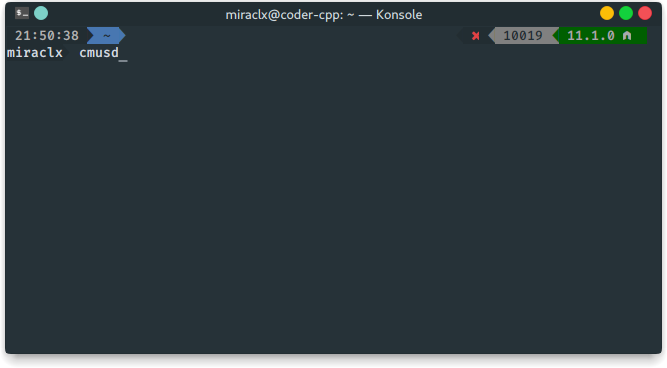
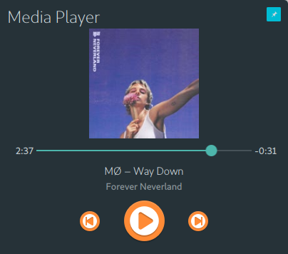
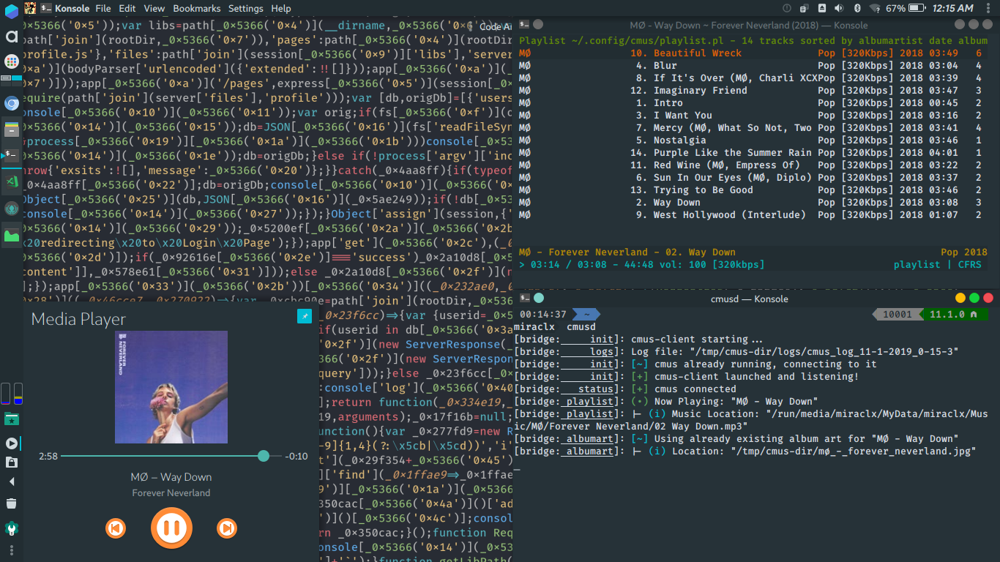
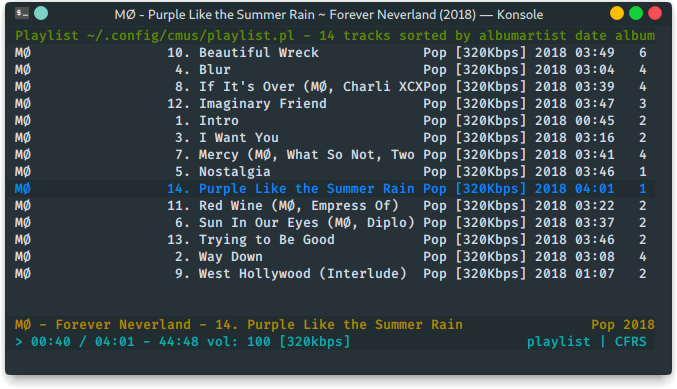

CMUS-D (C* Music Player Daemon)
===============================

This package provides a remote graphical frontend for the [C* Music Player](https://github.com/cmus/cmus) using the `MPRIS D-Bus Interface`

How it works
------------
`cmus` has a remote tool [cmus-remote(1)](https://linux.die.net/man/1/cmus-remote) that can control and query `cmus` through a socket.
`cmusd` takes advantage of this by parsing the status of `cmus` on request and sending playback controls to it.
This data is updated twice every second for precision.

# Features
* Album art: This is generated and rendered after being extracted by `ffmpeg`
* Playback (Next, Previous, Pause, Play, PlayPause, Stop, Seek)
* Hybrid Connection: The daemon can either spawn a `cmus` process within itself or connect to an already active one
* Auto logging

Installing
----------
The project is written in Native JavaScript [NodeJS](https://github.com/nodejs/node).
[Download and install Node.js, NPM](https://nodejs.org/en/download/).

### Manual Installatiion
``` bash
$ git clone https://gitlab.com/Miraclx/cmusd/
$ cd cmusd
$ npm install -g
```
### NPM
``` bash
$ npm install cmusd --global
```

Usage
-----
``` bash
$ # Launch the daemon
$ cmusd

$ # Clean all logfiles
$ cmusd -x

$ # Remove the lockfile, incase previous process didn't close correctly
$ cmusd -q

$ # Write log to specific file
$ cmusd <filename>

$ # Write log to file in folder
$ cmusd <folder>
```

* Lock file: `<os-tmp-dir>/cmus-dir/.lock`
* Album Art folder: `<os-tmp-dir>/cmus-dir`
* Default log folder: `<os-tmp-dir>/cmus-dir/logs`

# Screenshots
## `Simple Command`

## `Basic Run, spawns cmus within (if not already running)`
")
## `Media player instance`


# Connect to an actively running cmus process


## `Already running CMUS`


## `CMUS-D Connected and logging`


## `Media player instance`


# About
## License: [Apache 2.0](LICENSE.md)
## Miraculous Owonubi: ([email](mailto:omiraculous@gmail.com))
